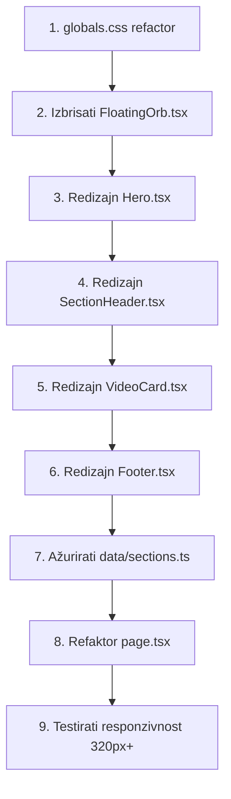

# UI Redesign Plan — Kako Klanjati

## Dizajn Direktiva

### Vizuelni identitet

- **Paleta:** Topla zelena (warm green) — umjesto hladnog emerald/teal, koristimo maslinasto zelenu, sage, i tople šumske zelene nijanse
- **Akcent:** Topla zlatna/oker (samo za suptilne highlighte)
- **Pozadina:** Zagasito bijela/krem (warm off-white), nikako čisto bijela
- **Tekst:** Topli tamno sivi / tamno zeleni (ne čisto crni)
- **Gradijenti:** Nema agresivnih gradijenata. Ako ih bude, samo suptilni radijalni ili linearni sa vrlo niskom opacity
- **Animacije:** Samo na scroll (korištenjem CSS `@keyframes` ili `tw-animate-css`), bez pulsiranja, bez floating orbova

### Principi

1. **Tipografija je heroj** — pusti tekst da diše, veliki whitespace, dobar hierarchy
2. **Bez AI tell-ova** — nema floating orbova, nema pulse-animacija na ikonama, nema gradient textova, nema gradient borderova na hover
3. **Mobile-first** — sve komponente testirane na 320px+, a na laptopu izgledaju premium
4. **Ručno rađen osjećaj** — suptilni detalji (dekorativni ornamenti, pažljivo odabrani fontovi, konzistentan spacing)

---

## Plan izmjena — po fajlovima

---

### 1. `app/globals.css` — Potpuni refactor

#### Šta se mijenja:

- **Color palette:** Zamijeniti postojeće `--site-emerald-*` varijable sa toplijim zelenim nijansama
  - `--site-green-50` do `--site-green-900` — topla zelena (maslinasta, sage)
  - `--site-gold-400`, `--site-gold-500` — topla zlatna za akcente
- **Ukloniti:** `.bg-pattern` klasu (geometrijski pattern je previše očigledan)
- **Ukloniti:** `.card` klasu — prebaciti u Tailwind u komponentama
- **Ukloniti:** `.btn-emerald` klasu — prebaciti u Tailwind
- **Ukloniti:** `.hero-gradient` klasu
- **Zadržati i poboljšati:** `.decorative-heading` — refinirati underline motiv
- **Dodati:** CSS za dekorativni islamski ornament (geometrijski, suptilan, korišten kao pseudo-element ili background)
- **Dodati:** Smooth scroll
- **Dodati:** Custom scrollbar styling
- **Dodati:** Selection styling u toploj zelenoj
- **Refaktor:** `@theme inline` blok da koristi nove boje

#### Primjer novih boja:

```css
--site-green-50: #f4f7f0; /* warm off-white with green hint */
--site-green-100: #e3ead9;
--site-green-200: #c7d6b3;
--site-green-300: #a3bd85;
--site-green-400: #7fa35a;
--site-green-500: #5b7b3a; /* primary — warm olive */
--site-green-600: #4a6f3e; /* darker warm green */
--site-green-700: #3d5a33;
--site-green-800: #2e4527;
--site-green-900: #1e2e1a;
```

---

### 2. `app/page.tsx` — Refaktor

#### Šta se mijenja:

- **Ukloniti:** `import { FloatingOrb }` i sve FloatingOrb instance (`page.tsx:4`, `page.tsx:17-25`)
- **Promijeniti:** Background div — umjesto `from-slate-50 via-white to-emerald-50` koristiti solid `bg-[var(--site-green-50)]` (warm off-white)
- **Ukloniti:** `relative overflow-hidden` sa glavnog diva (više nema orbova)
- **Dodati:** Suptilni pozadinski pattern preko CSS varijable (opcionalno)

---

### 3. `components/FloatingOrb.tsx` — Brisanje

Cijeli fajl se briše.

---

### 4. `components/Hero.tsx` — Redizajn

#### Šta se mijenja:

- **Ukloniti:** Gradient text (`bg-gradient-to-r from-emerald-700 via-teal-600 to-emerald-800 bg-clip-text text-transparent`)
- **Zamijeniti:** Solid `text-[var(--site-green-800)]` ili slično
- **Ukloniti:** `font-extrabold` — koristiti `font-bold` za sofisticiraniji izgled
- **Dodati:** Dekorativni islamski ornament iza naslova (CSS pseudo-element — stilizovana zvijezda/geometrijski motiv, vrlo suptilan, opacity 0.03-0.05)
- **Poboljšati:** Typography spacing — povećati `tracking-tight`, dodati `leading-tight`
- **Dodati:** Suptilni underline/akcent ispod naslova (solid color, ne gradient)
- **Zadržati:** Animaciju na mount (fade-in + translate)

---

### 5. `components/SectionHeader.tsx` — Redizajn

#### Šta se mijenja:

- **Ukloniti:** Gradient pozadinu na ikoni (`bg-gradient-to-r ${color}`)
- **Zamijeniti:** Solid background boja (jednaka primary color), jednostavan krug
- **Ukloniti:** Gradient tekst (`bg-gradient-to-r from-gray-900 to-gray-700 bg-clip-text text-transparent`)
- **Zamijeniti:** Solid `text-[var(--site-green-800)]`
- **Ukloniti:** Gradient underline ispod naslova (`bg-gradient-to-r ${color}`)
- **Zamijeniti:** Solid underline u primary boji

---

### 6. `components/VideoCard.tsx` — Redizajn

#### Šta se mijenja:

- **Ukloniti:** Gradient overlay preko cijele kartice (`bg-gradient-to-br ${sectionColor} opacity-10`)
- **Ukloniti:** Gradient button (`bg-gradient-to-r ${sectionColor}`) — zamijeniti sa solid bojom
- **Ukloniti:** Gradient hover border (`border-2 border-transparent bg-gradient-to-r`)
- **Ukloniti:** `animate-pulse` na `PlayCircle` ikoni
- **Ukloniti:** `scale-[1.04]` na hover (previše AI-generično)
- **Dodati:** Suptilniji hover — `shadow-md` → `shadow-xl`, lagani `translateY(-2px)`
- **Dodati:** Lijevi border akcent u boji sekcije (solid), na hover postaje malo deblji
- **Poboljšati:** Unutrašnji spacing i tipografiju

---

### 7. `components/Footer.tsx` — Redizajn

#### Šta se mijenja:

- **Ukloniti:** Gradient pozadinu (`bg-gradient-to-r from-emerald-900 to-teal-900`)
- **Zamijeniti:** Solid `bg-[var(--site-green-800)]` ili tamnija nijansa
- **Ukloniti:** `animate-pulse` na Heart ikoni
- **Dodati:** Ikone za društvene mreže (umjesto plain text linkova) — koristiti lucide-react ikone
- **Dodati:** Suptilni top border (dekorativna linija)
- **Poboljšati:** Spacing i layout na mobile-u

---

### 8. `data/sections.ts` — Ažuriranje boja

#### Šta se mijenja:

- Zamijeniti `color` stringove da koriste topliju zelenu paletu:
  - Teorija: `from-green-600 to-green-700` (umjesto emerald/teal)
  - Praktično: `from-green-500 to-green-600`
  - Namazi: `from-green-700 to-green-800`
  - Kratke Sure: `from-amber-600 to-amber-700` (zlatni akcent)

---

## Tok implementacije



---

## Ključne promjene — vizuelni pregled

| Komponenta     | Prije (AI-generično)                                   | Poslije (hand-crafted)                     |
| -------------- | ------------------------------------------------------ | ------------------------------------------ |
| Background     | Gradient `from-slate-50 via-white to-emerald-50`       | Solid warm off-white `#f4f7f0`             |
| Hero naslov    | Gradient text sa 3 boje                                | Solid warm dark green, clean typography    |
| Floating orbs  | 3 blur-3l animirana orb-a                              | Uklonjeno u potpunosti                     |
| Sekcija header | Gradient ikona + gradient text + gradient underline    | Solid ikona + solid text + solid underline |
| Video kartice  | Gradient hover border + scale(1.04) + pulse PlayCircle | Clean shadow hover + left border accent    |
| Dugmad         | Gradient pozadina                                      | Solid boja sa hover tamnijom nijansom      |
| Footer         | Gradient `from-emerald-900 to-teal-900`                | Solid tamno zelena sa ikonama              |
